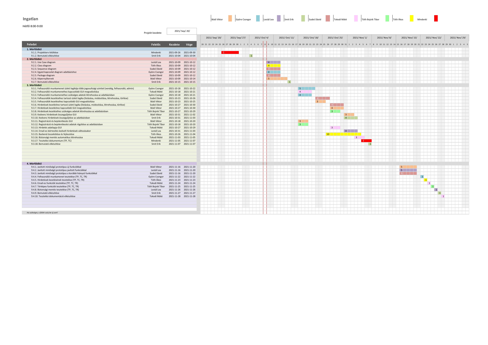

# Ingatlan2.com Projektterv 2021

## 1. Összefoglaló

Ez a projektterv az Ingatlan projektet mutatja be, mely 2021-09-20-től 2021-11-27-ig tart. A projekt célja, hogy
megfelelő felületet biztosítson a ingatlanok adás / vételével kapcsolatos feladatok online elvégézésére és az adatok
nyilvántartására. Mindezért egy egyszerűen használható, átlátható és hatékonyan működő webalkalmazás fog felelni. A
projekten nyolc fő fejlesztő fog dolgozni, az elvégzett feladatokat pedig négy alkalommal fogjuk prezentálni a
megrendelőnek.

## 2. Verziók

| Verzió | Szerző(k) | Dátum      | Státusz  | Megjegyzés              |
| ------ | --------- | ---------- | -------- | ----------------------- |
| 0.1    | Mindenki  | 2021-10-04 | Tervezet | A projektterv kitöltése |
| 0.2    | Mindenki  | 2021-11-19 | Tervezet | Prototípus 1.           |

Státusz osztályozás:

- Tervezet: befejezetlen dokumentum, a mérföldkő leadása előtti napokban
- Előterjesztés: a projekt menedzser bírálatával, a mérföldkő határidejekor
- Elfogadott: a megrendelő által elfogadva, a prezentáció bemutatásakor

A prototípus eléerhető a [https://teszt-2021-ib153i-14-ingatlan.herokuapp.com/](https://teszt-2021-ib153i-14-ingatlan.herokuapp.com/) linken

## 3. A projekt bemutatása

Az ingatlan2.com lényege, hogy a szállást kereső személyek megtalálhassák álmaik otthonát. A weboldalunk számtalan
különböző féle ingatlant kínál vételre, de lehetőséget nyújt újabb ingatlanok eladásra bocsájtásrára is. Eldöntheti,
hogy csak böngészik a meghírdetett ingatlanok között; de ha úgy tartja kedve, akkor képek, és megfelelő adatok
megadásával a saját tulajdonában levő ingatlanáról is feltehet hírdetést. Részletes keresőnkkel szinte biztosan
megtalálja magának álmai otthonát. De ha jelenleg nem is engedhetné meg magának, hogy megveszi a kiszemelt ingatlant,
elmentheti a "kedvencek" közé, ahol bármikor újra megtalálhatja.

### 3.1. Rendszerspecifikáció

A rendszernek képesnek kell lennie arra, hogy a felhasználók zökkenőmentesen bírjanak böngészni az elérhető ingatlanok
közöt. Valamint hirdetéseket feltölteni regisztrációt és bejelentkezést követően. A vevő és eladó / kiadó közötti
biztonságos kapcsolatfelvétel biztosítása. Valamint a felhasználók kedvenc ú.n. "kedvelt" hirdetéseinek számontartása,
és megjelenítése. Minden funkció a megfelelő felhasználói jogosultság mellett használható, annak függvényében írható,
olvasható vagy nem megtekinthető az adat.

### 3.2. Funkcionális követelmények

- Felhasználói munkamenet megvalósítása több jogosultsági szinttel (admin, felhasználó)
  - vendég (nem bejelentkezett) felhasználók csak böngészni képesek
  - felhasználók böngészni és hirdetést készíteni képesek
  - adminok képesek módosítani egy hirdetést, és felhasználók jogosultságait
- Felhasználók kezelése (CRUD)
- Hirdetések kezelése (CRUD)
  - Hirdetésekről tárolünk:
    - Cím
    - Leírás
    - tagek
    - típus (lakás / ház)
    - terület
    - Helység
    - Tartalmaz-e bútorokat
    - 1db képet róla
- Hirdetések kedvelése / kedvencezése stb (CRUD)
- Email-es értesítés kedvelt ingatlanok állapotáról
- Beágyazott google maps-en megjeleníteni az adott címet
- Kapcsolatfelvételi infofmációk megjelenítése
  - telefonszám, e-mail cím
- Biztonsági mentés automatikus létrehozása
- keresés / szűrés funkció ingatlan hirdetések között
  - keresés szöveg, helyszím (város, utca) alapján

### 3.3. Nem funkcionális követelmények

- A kliens oldal platform- és böngészőfüggetlen legyen
- Reszponzív megjelenés
- Szenzitív adatokat biztonságosan tároljuk
- A legfrissebb technológiákat használja a rendszer

## 4. Költség- és erőforrás-szükségletek

Az erőforrásigényünk összesen kb. 24 személynap/fő.

A rendelkezésünkre áll összesen 70 \* 8 = 560 pont.

## 5. Szervezeti felépítés és felelősségmegosztás

A projekt megrendelője Dr. Pflanzner Tamás. Az Ingatlan projektet a projektcsapat fogja végrehajtani, amely jelenleg
nyolc fejlesztőből áll. A csapatban csak pályakezdő webprogramozó van.

### 5.1 Projektcsapat

A projekt a következő emberekből áll:

|                                                | Név                 | E-mail cím (stud-os)     |
| ---------------------------------------------- | ------------------- | ------------------------ |
| Megrendelő                                     | Dr. Pflanzner Tamás | tampfla@inf.u-szeged.hu  |
| Felelősségek: Projekt tag                      | Bódi Viktor         | h751274@stud.u-szeged.hu |
| Felelősségek: Diagramok, Projekt tag           | Györe Csongor       | h045428@stud.u-szeged.hu |
| Felelősségek: Projekt tag                      | Lestál Lea          | h048225@stud.u-szeged.hu |
| Felelősségek: Bemutatók, Projekt tag           | Smit Erik           | h051483@stud.u-szeged.hu |
| Felelősségek: Backend, Diagramok, Projekt tag  | Szabó Dávid         | h051718@stud.u-szeged.hu |
| Felelősségek: Projekt Manager                  | Tokodi Máté         | h052794@stud.u-szeged.hu |
| Felelősségek: Projekt tag                      | Tóth Bojnik Tibor   | h052972@stud.u-szeged.hu |
| Felelősségek: Backend fejlesztése, Projekt tag | Tóth Ákos           | h053206@stud.u-szeged.hu |

## 6. A munka feltételei

### 6.1. Munkakörnyezet

A projekt a következő munkaállomásokat fogja használni a munka során:

| Név               | Számítógép                 | Spec                                                                      |
| ----------------- | -------------------------- | ------------------------------------------------------------------------- |
| Tokodi Máté       | Acer Nitro 5 laptop        | CPU: Ryzen 5 4600H, RAM: 32GB, GPU: Nvidia GTX1650 OS: Manjaro Linux      |
| Tóth Ákos         | Asztali számítógép         | CPU: i5 4460, RAM: 16GB, GPU: Nvidia GTX1060 OS: Ubuntu 20.04             |
| Tóth Ákos         | Dell Latitude E7270 laptop | CPU: i5 6600U, RAM: 8GB, GPU: Intel HD graphics, OS: Ubuntu 20.04         |
| Györe Csongor     | Asus VivoBook laptop       | CPU: i5 i5-8265U, RAM: 8GB, GPU: NVIDIA GeForce MX250, OS: Windows 11     |
| Szabó Dávid       | Asus ROG laptop            | CPU: Ryzen 5 5600h, RAM: 8GB, GPU: nvidia GeForce RTX3050, OS: Windows 10 |
| Smit Erik         | Lenovo Ideapad L340 Gaming | CPU: Intel Core i7-9750H, RAM 8GB, GPU: nvidia GTX1650, OS: Windows 10    |
| Tóth Bojnik Tibor | Asus Tuf fx505du           | CPU: Ryzen 7 3750h, RAM 8GB, GPU: nvidia GTX1660 ti, OS: Windows 10       |
| Lestál Lea        | Dell Latitude-E6520 laptop | CPU: i7-2760QM, RAM 8GB, GPU: NVD9, OS: Ubuntu 20.04.3                    |
| Bódi Viktor       | Lenovo Legion Y540         | CPU: i7-9750H, RAM 16GB, GPU: Nvidia GTX1660 ti, OS: Windows 10           |

|

A projekt a következő technológiákat/szoftvereket fogja használni a munka során:

- Heroku platformszolgáltatás
- Heroku által biztosított PostgreSQL adatbázisszerver
- Spring Boot (backend)
- HTML + CSS (Bootstrap/tailwind/thymeleaf)
- Maven szoftverprojekt menedzselő szoftver
- Intellij IDEA IDE
- Git verziókövető (GitLab)

### 6.2. Rizikómenedzsment

| Kockázat                                  | Leírás                                                                                                                                                                                   | Valószínűség | Hatás |
| ----------------------------------------- | ---------------------------------------------------------------------------------------------------------------------------------------------------------------------------------------- | ------------ | ----- |
| Betegség                                  | Súlyosságtól függően hátráltatja vagy bizonyos esetekben teljes mértékben korlátozza a munkavégzőt, így az egész projektre kihatással van. Megoldás: a feladatok átcsoportosítása        | nagy         | erős  |
| Kommunikációs fennakadás a csapattagokkal | A csapattagok között nem elégséges az információ áramlás, nem pontosan, esetleg késve vagy nem egyértelműen tájékoztatjuk egymást. Megoldás: még gyakoribb megbeszélések és ellenőrzések | kis          | erős  |

## 7. Jelentések

### 7.1. Munka menedzsment

A munkát Tokodi Máté koordinálja. Fő feladata, hogy folyamatosan egyeztessen a csapattagokkal az előrehaladásról és a
fellépő problémákról, esetlegesen a megoldásban is segítséget nyújhat a projekt csúszásának elkerülése végett. További
feladata a heti szinten tartandó csoportgyűlések időpontjának és helyszínének leszervezése, erről discord-on
tájékoztatja a projektcsapatot.

### 7.2. Csoportgyűlések

A projekt hetente ülésezik, hogy megvitassák az azt megelőző hét problémáit, illetve hogy megbeszéljék a következő hét
feladatait. A megbeszélésről minden esetben memó készül.

#### 1. megbeszélés:

- **Időpont**: 2021.09.22.
- **Hely**: SZTE TIK - Szeged, Ady Tér 10.
- **Résztvevők**: Mindenki
- **Érintett témák**: Ismerkedés, Projektterv megbeszélése

#### 2. megbeszélés:

- **Időpont**: 2021.09.29.
- **Hely**: SZTE TIK - Szeged, Ady Tér 10.
- **Résztvevők**: Mindenki
- **Érintett témák**: Projektterv megbeszélése 2: az emberek nagyrésze vállalt valamiféle komponensért felelősséget

#### 3. megbeszélés:

- **Időpont**: 2021.10.09.
- **Hely**: Discord
- **Résztvevők**: Tokodi Máté, Smit Erik, Tóth Bojnik Tibor, Bódi Viktor, Szabó Dávid, Lestál Lea, Tóth Ákos
- **Érintett témák**: 2.Mértföldkö taskjainak átbeszélése

#### 4. megbeszélés:

- **Időpont**: 2021.10.24.
- **Hely**: Discord
- **Résztvevők**: Tokodi Máté, Smit Erik, Bódi Viktor, Szabó Dávid, Tóth Ákos, Györe Csongor
- **Érintett témák**: Diagramok átbeszélése és egyeztetése

#### 5. megbeszélés:

- **Időpont**: 2021.10.31.
- **Hely**: Discord
- **Résztvevők**: Tokodi Máté, Smit Erik, Bódi Viktor, Szabó Dávid, Tóth Ákos, Tóth Bojnik Tibor
- **Érintett témák**: Spring Boot template projekt, és a feladatok időben elkezdése

#### 6. megbeszélés:

- **Időpont**: 2021.11.02.
- **Hely**: Discord
- **Résztvevők**: Tokodi Máté, Smit Erik, Bódi Viktor
- **Érintett témák**: Frontend html lapok megírása, hogy a bakcend megindulhasson

#### 7. megbeszélés:

- **Időpont**: 2021.11.05.
- **Hely**: Discord
- **Résztvevők**: Tóth Bojnik Tibor, Szabó Dávid, Györe Csongor, Lestál Lea, Tóth Ákos
- **Érintett témák**: Backend alapook megírása

#### 8. megbeszélés:

- **Időpont**: 2021.11.06.
- **Hely**: Discord
- **Résztvevők**: Tokodi Máté, Tóth Bojnik Tibor, Szabó Dávid, Györe Csongor, Lestál Lea, Tóth Ákos
- **Érintett témák**: Backend alapook megírása, frontend css style elkezdése

#### 9. megbeszélés:

- **Időpont**: 2021.11.07.
- **Hely**: Discord
- **Résztvevők**: Tokodi Máté, Smit Erik, Tóth Bojnik Tibor, Szabó Dávid, Györe Csongor
- **Érintett témák**: Backend alapook megírása, frontend css style elkezdése

#### 10. megbeszélés:

- **Időpont**: 2021.11.15.
- **Hely**: Discord
- **Résztvevők**: Tokodi Máté, Smit Erik, Tóth Bojnik Tibor, Szabó Dávid, Györe Csongor, Tóth Ákos, Bódi Viktor
- **Érintett témák**: Hirdetések létrehozása

### 7.3. Minőségbiztosítás

Az elkészült terveket a terveken nem dolgozó csapattársak közül átnézik, hogy megfelel-e a specifikációnak és az egyes
diagramtípusok összhangban vannak-e egymással. A meglévő rendszerünk helyes működését a prototípusok bemutatása előtt a
tesztelési dokumentumban leírtak végrehajtása alapján ellenőrizzük és összevetjük a specifikációval, hogy az elvárt
eredményt kapjuk-e. További tesztelési lehetőségek: unit tesztek írása az egyes modulokhoz vagy a kód közös átnézése (
code review) egy, a vizsgált modul programozásában nem résztvevő csapattaggal. Szoftverünk minőségét a végső leadás
előtt javítani kell a rendszerünkre lefuttatott kódelemzés során kapott metrikaértékek és szabálysértések
figyelembevételével. Az alábbi lehetőségek vannak a szoftver megfelelő minőségének biztosítására:

- Specifikáció és tervek átnézése (kötelező)
- Teszttervek végrehajtása (kötelező)
- Unit tesztek írása (választható)
- Kód átnézése (választható)

### 7.4. Átadás, eredmények elfogadása

A projekt eredményeit Dr. Pflanzner Tamás fogja elfogadni. A projektterven változásokat csak Dr. Pflanzner Tamás írásos
kérés esetén Dr. Pflanzner Tamás engedélyével lehet tenni. A projekt eredményesnek bizonyul, ha specifikáció helyes és
határidőn belül készül el. Az esetleges késések pontlevonást eredményeznek. Az elfogadás feltételeire és beadás
formájára vonatkozó részletes leírás a következő honlapon olvasható: https://okt.sed.hu/rf1/

### 7.5. Státuszjelentés

Minden leadásnál a projektmenedzser jelentést tesz a projekt haladásáról, és ha szükséges változásokat indítványoz a
projektterven. Ezen kívül a megrendelő felszólítására a menedzser 3 munkanapon belül köteles leadni a jelentést. A
gyakorlatvezetővel folytatott csapatmegbeszéléseken a megadott sablon alapján emlékeztetőt készít a csapat, amit a
következő megbeszélésen áttekintenek és felmérik az eredményeket és teendőket. Továbbá gazdálkodnak az erőforrásokkal és
szükség esetén a megrendelővel egyeztetnek a projektterv módosításáról.

## 8. A munka tartalma

### 8.1. Tervezett szoftverfolyamat modell és architektúra

A szoftver fejlesztése során az agilis fejlesztési modellt alkalmazzuk. A fejlesztés során nagy hangsúlyt fektetünk a
folyamatos kommunikcióra. A fejlesztés során a szoftver specifikációi rugalmasan vátozhatnak, és ezzel a módszertannal
tudunk a leggyorsabban alkalmazkodni az új elvárásokhoz.

A szoftver MVC alapú REST webszolgáltatásként működik. A szerver és a kliens függetlenek, csupán API végpontok
segítségével kommunikálnak.

### 8.2. Átadandók és határidők

A főbb átadandók és határidők a projekt időtartama alatt a következők:

| Szállítandó |                Neve                 | Határideje |
| :---------: | :---------------------------------: | :--------: |
|     D1      |       Projektterv és útmutató       | 2021-10-10 |
|    P1+D2    | UML, DB, képernyőtervek és bemutató | 2021-10-18 |
|    P1+D3    |      Prototípus I. és bemutató      | 2021-11-08 |
|    P2+D4    |     Prototípus II. és bemutató      | 2021-11-29 |

(D - dokumentáció, P - prototípus)

## 9. Feladatlista

A következőkben a tervezett feladatok részletes összefoglalása található.

### 9.1. Projektterv (1. mérföldkő)

Ennek a feladatnak az a célja, hogy megvalósításhoz szükséges lépéseket, az ütemzést és a felelősöket meghatározzuk.

Részfeladatai a következők:

#### 9.1.1. Projektterv kitöltése

Felelős: Mindenki

Tartam: 4 nap

Erőforrásigény: 1 személynap/fő

#### 9.1.2. Bemutató elkészítése

Felelős: Smit Erik

Tartam: 2 nap

Erőforrásigény: 1 személynap

A mérföldkőhöz tartozó feladatok bemutatása, pl. téma, tervezett funkciók, tagok, Gantt diagram.

### 9.2. UML és adatbázis tervek (2. mérföldkő)

Ennek a feladatnak az a célja, hogy a rendszerarchitektúrát, az adatbázist és webalkalmazás kinézetét megtervezzük.

Részfeladatai a következők:

#### 9.2.1. Use Case diagram

Felelős: Lestál Lea

Tartam: 4 nap

Erőforrásigény: 1 személynap

#### 9.2.2. Class diagram

Felelős: Tóth Ákos

Tartam: 4 nap

Erőforrásigény: 2 személynap

#### 9.2.3. Sequence diagram

Felelős: Szabó Dávid

Tartam: 4 nap

Erőforrásigény: 1 személynap

#### 9.2.4. Egyed-kapcsolat diagram adatbázishoz

Felelős: Györe Csongor

Tartam: 4 nap

Erőforrásigény: 3 személynap

#### 9.2.5. Package diagram

Felelős: Szabó Dávid

Tartam: 4 nap

Erőforrásigény: 1 személynap

#### 9.2.6. Képernyőtervek

Felelős: Bódi Viktor

Tartam: 5 nap

Erőforrásigény: 1 személynap

#### 9.2.7. Bemutató elkészítése

Felelős: Smit Erik

Tartam: 1 nap

Erőforrásigény: 1 személynap

### 9.3. Prototípus I. (3. mérföldkő)

Ennek a feladatnak az a célja, hogy egy működő prototípust hozzunk létre, ahol a vállalt funkcionális követelmények nagy
része már prezentálható állapotban van.

Részfeladatai a következők:

#### 9.3.1. Felhasználói munkamenet üzleti logikája több jogosultsági szinttel (vendég, felhasználó, admin)

Felelős: Györe Csongor

Tartam: 5 nap

Erőforrásigény: 2 személynap

#### 9.3.2. Felhasználói munkamenethez kapcsolódó GUI megvalósítása

Felelős: Tokodi Máté

Tartam: 4 nap

Erőforrásigény: 2 személynap

#### 9.3.3. Felhasználói munkamenethez szükséges adatok létrehozása az adatbázisban

Felelős: Györe Csongor

Tartam: 4 nap

Erőforrásigény: 1 személynap

#### 9.3.4. Felhasználók kezeléséhez tartozó üzleti logika (listázása, módosítása, létrehozása, törlése)

Felelős: Szabó Dávid

Tartam: 4 nap

Erőforrásigény: 2 személynap

#### 9.3.5. Felhasználók kezeléséhez kapcsolódó GUI megvalósítása

Felelős: Bódi Viktor

Tartam: 3 nap

Erőforrásigény: 1 személynap

#### 9.3.6. Hirdetések kezeléshez tartozó üzleti logika (listázása, módosítása, létrehozása, törlése)

Felelős: Szabó Dávid

Tartam: 4 nap

Erőforrásigény: 2 személynap

#### 9.3.7. Hirdetések kezeléshez kapcsolódó GUI megvalósítása

Felelős: Bódi Viktor

Tartam: 4 nap

Erőforrásigény: 2 személynap

#### 9.3.8. Hirdetések kezeléséhez szükséges adatok létrehozása az adatbázisban

Felelős: Tóth Bojnik Tibor

Tartam: 3 nap

Erőforrásigény: 2 személynap

#### 9.3.9. Kedvenc hírdetések összegyűjtése GUI

Felelős: Bódi Viktor

Tartam: 3 nap

Erőforrásigény: 1 személynap

#### 9.3.10. Kedvenc hírdetések összegyűjtése az adatbázisban

Felelős: Smit Erik

Tartam: 4 nap

Erőforrásigény: 2 személynap

#### 9.3.11. Regisztráció és bejelentkezés GUI

Felelős: Bódi Viktor

Tartam: 3 nap

Erőforrásigény: 1 személynap

#### 9.3.12. Regisztráció és bejelentkezési adatok rögzítése az adatbázisban

Felelős: Tóth Bojnik Tibor

Tartam: 3 nap

Erőforrásigény: 2 személynap

#### 9.3.13. Hirdetés adatlapja GUI

Felelős: Tokodi Máté

Tartam: 3 nap

Erőforrásigény: 1 személynap

#### 9.3.14. Email-es kiértesítés kedvelt hirdetések változásakor

Felelős: Lestál Lea

Tartam: 4 nap

Erőforrásigény: 3 személynap

#### 9.3.15. Backend összekötése és fejlesztése

Felelős: Tóth Ákos

Tartam: 10 nap

Erőforrásigény: 2 személynap

#### 9.3.16. Biztonsági mentés automatikus létrehozása

Felelős: Tokodi Máté

Tartam: 3 nap

Erőforrásigény: 2 személynap

#### 9.3.17. Tesztelési dokumentum (TP, TC)

Felelős: Mindenki

Tartam: 3 nap

Erőforrásigény: 1 személynap/fő

#### 9.3.18. Bemutató elkészítése

Felelős: Smit Erik

Tartam: 1 nap

Erőforrásigény: 1 személynap

### 9.4. Prototípus II. (4. mérföldkő)

Ennek a feladatnak az a célja, hogy az előző mérföldkő hiányzó funkcióit pótoljuk, illetve a hibásan működő funkciókat
és az esetlegesen felmerülő új funkciókat megvalósítsuk. Továbbá az alkalmazás alapos tesztelése is a mérföldkőben
történik.

Részfeladatai a következők:

#### 9.4.1. Javított minőségű prototípus új funkciókkal

Felelős: Bódi Viktor

Tartam: 5 nap

Erőforrásigény: 1 személynap

#### 9.4.2. Javított minőségű prototípus javított funkciókkal

Felelős: Lestál Lea

Tartam: 5 nap

Erőforrásigény: 2 személynap

#### 9.4.3. Javított minőségű prototípus a korábbi hiányzó funkciókkal

Felelős: Szabó Dávid

Tartam: 5 nap

Erőforrásigény: 2 személynap

#### 9.4.4. Felhasználói munkamenet tesztelése (TP, TC, TR)

Felelős: Györe Csongor

Tartam: 1 nap

Erőforrásigény: 1 személynap

#### 9.4.5. Hirdetések kezelésének tesztelése (TP, TC, TR)

Felelős: Tóth Ákos

Tartam: 1 nap

Erőforrásigény: 1 személynap

#### 9.4.6. Email-es funkciók tesztelése (TP, TC, TR)

Felelős: Tokodi Máté

Tartam: 1 nap

Erőforrásigény: 1 személynap

#### 9.4.7. Térképes funkciók tesztelése (TP, TC, TR)

Felelős: Tóth Bojnik Tibor

Tartam: 1 nap

Erőforrásigény: 1 személynap

#### 9.4.8. Biztonsági mentés tesztelése (TP, TC, TR)

Felelős: Lestál Lea

Tartam: 1 nap

Erőforrásigény: 1 személynap

#### 9.4.9. Bemutató elkészítése

Felelős: Smit Erik

Tartam: 1 nap

Erőforrásigény: 1 személynap

#### 9.4.10. Tesztelési dokumentáció elkészítése

Felelős: Tokodi Máté

Tartam: 1 nap

Erőforrásigény: 1 személynap

## 10. Részletes időbeosztás

## 11. Projekt költségvetés

### 11.1. Részletes erőforrásigény (személynap)

| Név               | 1. leadás - Projektterv | 2. leadás - UML és adatbázis | 3. leadás - Prototípus I. | 4. leadás - Prototípus II. | Összesen |
| ----------------- | :---------------------: | :--------------------------: | :-----------------------: | :------------------------: | :------: |
| Bódi Viktor       |            1            |              2               |            15             |             5              |    23    |
| Györe Csongor     |            1            |              4               |            13             |             5              |    23    |
| Lestál Lea        |            1            |              3               |            14             |             5              |    23    |
| Smit Erik         |            2            |              3               |            14             |             5              |    24    |
| Szabó Dávid       |            1            |              4               |            14             |             6              |    25    |
| Tokodi Máté       |            2            |              2               |            15             |             5              |    24    |
| Tóth Bojnik Tibor |            1            |              2               |            15             |             5              |    23    |
| Tóth Ákos         |            1            |              3               |            15             |             5              |    24    |

### 11.2. Részletes feladatszámok

| Név               | 1. leadás - Projektterv | 2. leadás - UML és adatbázis | 3. leadás - Prototípus I. | 4. leadás - Prototípus II. | Összesen |
| ----------------- | :---------------------: | :--------------------------: | :-----------------------: | :------------------------: | :------: |
| Bódi Viktor       |            1            |              1               |             5             |             2              |    9     |
| Györe Csongor     |            1            |              1               |             3             |             2              |    7     |
| Lestál Lea        |            1            |              1               |             2             |             2              |    6     |
| Smit Erik         |            2            |              2               |             3             |             2              |    9     |
| Szabó Dávid       |            1            |              1               |             3             |             2              |    7     |
| Tokodi Máté       |            2            |              1               |             4             |             2              |    9     |
| Tóth Bojnik Tibor |            1            |              1               |             3             |             2              |    7     |
| Tóth Ákos         |            1            |              1               |             2             |             2              |    6     |

### 11.3. Részletes költségvetés

| Név                                    | 1. leadás - Projektterv | 2. leadás - UML és adatbázis | 3. leadás - Prototípus I. | 4. leadás - Prototípus II. | Összesen  |
| -------------------------------------- | :---------------------: | :--------------------------: | :-----------------------: | :------------------------: | :-------: |
| Maximálisan választható pontszám %-ban |         10% (7)         |           30% (21)           |         50% (35)          |          30% (21)          | 100% (70) |
| Bódi Viktor                            |            7            |              13              |            35             |             15             |    70     |
| Györe Csongor                          |            7            |              13              |            35             |             15             |    70     |
| Lestál Lea                             |            7            |              13              |            35             |             15             |    70     |
| Smit Erik                              |            7            |              13              |            35             |             15             |    70     |
| Szabó Dávid                            |            7            |              14              |            35             |             14             |    70     |
| Tokodi Máté                            |            7            |              13              |            35             |             15             |    70     |
| Tóth Bojnik Tibor                      |            7            |              13              |            35             |             15             |    70     |
| Tóth Ákos                              |            7            |              13              |            35             |             15             |    70     |

Szeged, 2021-10-25.
